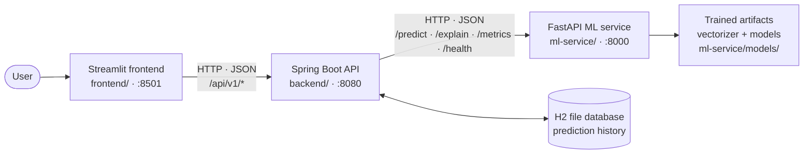

# NewsCheck — Fake News Classifier

A three-tier web app (Streamlit → Spring Boot → FastAPI/scikit-learn) that predicts whether a piece of news text **resembles the real or the fake articles in its training data**.

> **Read this first.** NewsCheck is an **ML prediction, not fact-checking.** It does not look anything up, verify any claim, or determine whether an article is true. It only reports which class of training example the *writing* looks more like. The "probability" it returns is the model's confidence in its own label, not the probability that a story is factually true. See [Data leakage](#data-leakage-read-this-before-trusting-the-accuracy) for why even the very high accuracy scores below should not be read as "it detects fake news".


## Table of contents

- [Problem statement](#problem-statement)
- [Architecture](#architecture)
- [Features](#features)
- [Tech stack](#tech-stack)
- [Project structure](#project-structure)
- [Dataset requirements](#dataset-requirements)
- [ML workflow](#ml-workflow)
- [TF-IDF in plain English](#tf-idf-in-plain-english)
- [Data leakage](#data-leakage-read-this-before-trusting-the-accuracy)
- [Model comparison and evaluation metrics](#model-comparison-and-evaluation-metrics)
- [API contract](#api-contract)
- [Installation, training and running](#installation-training-and-running)
- [Testing](#testing)
- [Limitations](#limitations)
- [Future improvements](#future-improvements)

## Problem statement

Misinformation is a real problem, and it is tempting to think a classifier can simply "spot fake news". In practice, a text classifier learns *statistical patterns of writing* in a labeled dataset — vocabulary, style, formatting, sourcing habits. Those patterns can correlate with the labels without having anything to do with truth.

This project builds a complete, tested classification system on a well-known public dataset and is deliberately candid about what that does and does not mean:

- **What it does:** given some English news text, estimate whether it looks more like the "REAL" or the "FAKE" articles it was trained on, and show which words drove that estimate.
- **What it does not do:** verify facts, check sources, detect all fake news, or generalize to news from other outlets, languages or time periods.

## Architecture



Data flow for one analysis (`POST /api/v1/analyze`):

1. The user pastes text into Streamlit.
2. Streamlit sends it to the Spring Boot API (it never talks to the ML service or the model files directly).
3. Spring Boot validates the request, then calls the ML service's `/predict` and `/explain`.
4. Only if both calls succeed, Spring Boot saves a history record to H2 and returns the combined result (label, confidence, top contributing words, disclaimer).

### Why three tiers? Why not call Python directly from Streamlit?

Streamlit *could* import the model and skip everything else. The tiers exist because each one owns a different concern:

- **ML service (Python):** all ML lives here, where scikit-learn lives. It knows nothing about users, storage or the UI.
- **Spring Boot API (Java):** the stable, product-facing layer. It is not a pass-through; it adds:
  - **Validation.** Requests are checked before any ML work happens: `text` must be non-blank and at most 20,000 characters, and `model` must be `logistic_regression` or `multinomial_nb` (default: `logistic_regression`).
  - **Prediction-history persistence.** Every successful analysis is stored (a text snippet, model, label, confidence and timestamp) in a file-based H2 database and exposed via `GET /api/v1/history`. The ML service itself is stateless.
  - **A stable API contract.** Clients depend on `/api/v1/*`. The ML service can be retrained, refactored or swapped without breaking the frontend, as long as the backend maps its responses.
  - **Error mapping.** Every failure becomes a consistent `{"error": "...", "message": "..."}` body. ML-service problems are translated: unreachable → `503 ml_service_unavailable`, model not trained → `503 ml_service_not_ready`, ML rejects the input → `400 invalid_input`, anything else upstream → `502 ml_service_error`. Clients never see raw stack traces or Python error shapes.
  - **Timeouts.** Connect timeout 2s, read timeout 10s, so a slow or dead ML service fails fast instead of hanging the UI.
- **Streamlit frontend:** a thin client. It renders results, the explanation chart, history and the metrics dashboard, and contains no ML logic.

The trade-off is more moving parts for a small app. For this project, the separation is the point: it mirrors how a real system would separate the ML runtime from the product API.

## Features

- Analyze pasted news text and get a **REAL/FAKE** label with the model's confidence in that label
- Choose between **Logistic Regression** (default) and **Multinomial Naive Bayes**
- **Word-level explanations:** the words and two-word phrases that pushed the model toward, or away from, its prediction
- **Prediction history** (persisted in H2, most recent first)
- **Metrics dashboard** built from the real training report (`metrics.json`)
- A visible "ML prediction, not fact-checking" disclaimer on every analyze response
- Leakage-aware preprocessing with the stripped-row counts recorded in the training report
- Consistent, friendly error handling across all tiers
- Automated tests for the ML service (pytest) and the backend (JUnit), a Maven wrapper (no global Maven needed), and Docker Compose for the whole stack

## Tech stack

| Tier | Directory | Stack (versions from the repo) |
|---|---|---|
| ML service | `ml-service/` | Python 3.12, FastAPI 0.141.1, uvicorn 0.53.0, pydantic 2.13.5, scikit-learn 1.9.0, pandas 2.3.1, numpy 2.3.2, joblib 1.5.3. Tests: pytest 9.1.1, httpx 0.28.1 |
| Backend | `backend/` | Java 17, Spring Boot 3.5.16 (Web, Validation, Data JPA), H2 file database, Maven wrapper (`mvnw`, `mvnw.cmd`), JUnit via `spring-boot-starter-test` |
| Frontend | `frontend/` | Streamlit 1.55.0, requests 2.32.4, plotly 7.1.0 |
| Packaging | repo root | Docker + Docker Compose |

## Project structure

```
.
├── docker-compose.yml
├── README.md
├── docs/                          # put screenshot.png here
├── ml-service/                    # FastAPI + scikit-learn (all ML lives here)
│   ├── main.py                    # FastAPI app: /predict /explain /metrics /health
│   ├── config.py                  # paths and settings (env-var driven)
│   ├── src/
│   │   ├── data_loader.py         # loads and validates Fake.csv / True.csv
│   │   ├── preprocessing.py       # cleaning, leakage stripping, dedup
│   │   ├── train.py               # split, TF-IDF, train models, write artifacts
│   │   ├── evaluation.py          # metrics, confusion matrix, ROC-AUC
│   │   └── predict.py             # inference + word-level explanations
│   ├── data/                      # Fake.csv + True.csv go here (NOT committed)
│   ├── models/                    # trained artifacts + metrics.json (NOT committed)
│   ├── tests/                     # pytest suite
│   ├── requirements.txt
│   ├── requirements-dev.txt
│   └── Dockerfile
├── backend/                       # Spring Boot API (com.fakenews.backend)
│   ├── src/main/java/.../{config,controller,dto,entity,exception,repository,service}
│   ├── src/main/resources/application.yml
│   ├── src/test/                  # JUnit tests
│   ├── mvnw, mvnw.cmd, .mvn/      # Maven wrapper
│   ├── pom.xml
│   └── Dockerfile
└── frontend/                      # Streamlit thin client
    ├── app.py                     # UI
    ├── api_client.py              # the only code that talks to the backend
    ├── charts.py                  # plotly charts
    ├── requirements.txt
    └── Dockerfile
```

## Dataset requirements

NewsCheck uses the Kaggle **"Fake and Real News Dataset"** (the ISOT dataset), which ships as two files:

- `Fake.csv`
- `True.csv`

Download them from Kaggle and place both in **`ml-service/data/`**:

```
ml-service/data/Fake.csv
ml-service/data/True.csv
```

**The dataset is not committed to this repository** (the `data/` folder is gitignored apart from a `.gitkeep`). Paths can be overridden with the `DATA_DIR`, `FAKE_CSV_PATH` and `TRUE_CSV_PATH` environment variables (see `ml-service/config.py`).

The training run recorded in `metrics.json` used 44,898 raw rows (Fake.csv 62,789,876 bytes, True.csv 53,582,940 bytes); the file hashes are stored in `metrics.json` so a run is traceable to exact inputs.

## ML workflow

`python -m src.train` runs the full pipeline (all numbers below are from the recorded training run in `ml-service/models/metrics.json`):

1. **Load** `Fake.csv` (label FAKE = 0) and `True.csv` (label REAL = 1). 44,898 rows in.
2. **Preprocess** (`src/preprocessing.py`):
   - Strip wire-service leakage markers from the article body (see [Data leakage](#data-leakage-read-this-before-trusting-the-accuracy)), then combine title + body.
   - Normalize whitespace (light touch: no stemming, no lowercasing at this stage).
   - Drop too-short rows (0 dropped), exact duplicates (**5,798** dropped) and obvious near-duplicates that differ only by casing, punctuation or spacing (**20** dropped).
   - Result: **39,080** rows — 21,175 REAL and 17,905 FAKE.
3. **Split before fitting anything.** Stratified 80/20 train/test split with `random_state=42`: **31,264** train and **7,816** test rows. Cleaning and de-duplication happen *before* the split so near-identical articles can't appear on both sides, and the TF-IDF vectorizer is fitted on the training set only.
4. **TF-IDF** (`TfidfVectorizer`): word 1–2-grams, English stop words removed, `min_df=5`, `max_df=0.9`, at most 50,000 features.
5. **Train three models:**
   - Logistic Regression (`max_iter=1000`, `class_weight="balanced"`)
   - Multinomial Naive Bayes
   - Dummy baseline (`most_frequent`), which always predicts the majority class and exists only as a floor
6. **Evaluate on the held-out test set:** accuracy, per-class and macro precision/recall/F1, confusion matrix, ROC-AUC. Everything is written to `models/metrics.json` together with library versions, dataset hashes and the leakage counts.

## TF-IDF in plain English

Models can't read words; they need numbers. **TF-IDF** (term frequency × inverse document frequency) turns each article into a list of word scores:

- **Term frequency:** a word that appears many times in *this* article gets a higher score there.
- **Inverse document frequency:** a word that appears in *almost every* article (like "the" or "said") is not informative, so it is down-weighted; a word that is rare across the collection, but shows up here, is up-weighted.

Multiplying the two gives high scores to words that are both prominent in this article and distinctive across the collection. Including two-word phrases (bigrams) lets the model see things like "breaking news" that single words miss. The classifiers then learn which weighted words tend to go with REAL and which with FAKE *in the training data*. This is also why explanations are word-based: for Logistic Regression, a word's push is its TF-IDF score times the model's learned weight for it.

## Data leakage: read this before trusting the accuracy

**This is the most important section of the README.**

In this dataset, the REAL articles come from **Reuters**, and nearly all of them carry source "tells": a dateline such as `WASHINGTON (Reuters) - ...` and inline agency tags. The FAKE articles come from a range of unreliable sites and do not have these. A classifier can therefore score very highly simply by detecting `(Reuters)` — which says something about *where the article was published*, not about whether it is true. That is **data leakage** (a shortcut in the data, not a skill of the model).

**What the preprocessing does about it** (`src/preprocessing.py`):

- It strips leading `CITY (Reuters) -` datelines and bare `(Reuters)`, `(AP)` and `(Associated Press)` tags from the article body *before* the title and body are combined.
- It counts how many rows it stripped per class and records that in `metrics.json`. From the raw data, before de-duplication, the markers were stripped from **21,247 REAL rows versus 41 FAKE rows**. That lopsidedness is the leakage, shown as a number.

**Why the score is still very high afterwards:**

Even with those markers removed, Logistic Regression still reaches **98.67% accuracy** on the test set (see below). The training pipeline itself flags this: any model above a 0.98 accuracy threshold is listed under `models_above_threshold`, and Logistic Regression is the one that trips it. Stripping the obvious tells does not remove every difference between the two sources. Reuters and the fake-news sites also differ in house style, topics, vocabulary, punctuation habits and the period they cover, and the model can pick all of that up.

**What this means for you:** the high accuracy partly reflects **dataset artifacts** — the model has learned "looks like Reuters wire copy vs. looks like these particular fake-news sites" — and **not** a general ability to detect fake news. Words the explanation view surfaces (for example, sensational or politically loaded terms such as "breaking" or "hillary" pushing a text toward FAKE) are best read as **style and topic markers of the training sources, not signals of falsehood**. A perfectly accurate story written in that style could be labeled FAKE, and a false story written in wire-service style could be labeled REAL. Do not expect this level of performance on articles from other outlets, and never treat the output as a verdict on truth.

## Model comparison and evaluation metrics

Evaluated on the held-out test set (7,816 articles: 4,235 REAL and 3,581 FAKE), after leakage stripping. Values are shown to 4 decimal places; exact values are in `ml-service/models/metrics.json`. Precision, recall and F1 are macro averages (the unweighted mean of the FAKE and REAL scores).

| Model | Accuracy | Precision (macro) | Recall (macro) | F1 (macro) | ROC-AUC |
|---|---|---|---|---|---|
| **Logistic Regression** | 0.9867 | 0.9869 | 0.9863 | 0.9866 | 0.9987 |
| Multinomial Naive Bayes | 0.9548 | 0.9544 | 0.9547 | 0.9545 | 0.9902 |
| Dummy baseline (`most_frequent`) | 0.5418 | 0.2709 | 0.5000 | 0.3514 | 0.5000 |

Per-class results:

| Model | Class | Precision | Recall | F1 | Support |
|---|---|---|---|---|---|
| Logistic Regression | FAKE | 0.9893 | 0.9816 | 0.9854 | 3,581 |
| Logistic Regression | REAL | 0.9845 | 0.9910 | 0.9878 | 4,235 |
| Multinomial NB | FAKE | 0.9486 | 0.9531 | 0.9508 | 3,581 |
| Multinomial NB | REAL | 0.9602 | 0.9563 | 0.9582 | 4,235 |
| Dummy baseline | FAKE | 0.0000 | 0.0000 | 0.0000 | 3,581 |
| Dummy baseline | REAL | 0.5418 | 1.0000 | 0.7028 | 4,235 |

Confusion matrices (rows = actual, columns = predicted):

| | Logistic Regression | | Multinomial NB | |
|---|---|---|---|---|
| | pred FAKE | pred REAL | pred FAKE | pred REAL |
| **actual FAKE** | 3,515 | 66 | 3,413 | 168 |
| **actual REAL** | 38 | 4,197 | 185 | 4,050 |

**Why the Dummy baseline matters.** Because the classes aren't perfectly balanced (54% REAL in the test set), a model that always says "REAL" scores 54.18% accuracy while having learned nothing. That is the floor any real model must clear, and it puts the other numbers in context: accuracy alone can hide a model that ignores a class. The baseline's ROC-AUC of 0.5 is chance level, and its FAKE precision, recall and F1 of 0.0 show it never detects a single fake article.

**Why per-class metrics matter.** A single accuracy number averages over both classes. Per-class precision and recall show *which mistakes* are made. For example, Logistic Regression's FAKE recall (0.9816) means 66 fake articles were passed as REAL, while its REAL recall (0.9910) means 38 real ones were flagged as FAKE. In a real application these two errors have different costs, and the baseline shows how a good-looking accuracy can hide a class the model never gets right.

**And remember the caveat:** these are scores on a test set drawn from the *same* leakage-prone dataset. They measure how well the models separate these two sources, not how well they would detect fake news in general.

## API contract

### Backend API (what clients use) — `http://localhost:8080`

| Method | Path | Description |
|---|---|---|
| `POST` | `/api/v1/analyze` | Validate → predict → explain → save to history → return the combined result |
| `GET` | `/api/v1/history?limit=20` | Recent analyses, newest first (`limit` 1–100, default 20) |
| `GET` | `/api/v1/metrics` | The training/evaluation report (relayed from the ML service) |
| `GET` | `/api/v1/health` | Backend health, including the status of the ML service |

`POST /api/v1/analyze` request (`model` is optional):

```json
{ "text": "Some news headline or article text...", "model": "logistic_regression" }
```

Response (JSON fields are snake_case):

```json
{
  "label": "REAL | FAKE",
  "probability": 0.0,
  "model": "logistic_regression",
  "explanation": {
    "top_positive": [{ "word": "...", "contribution": 0.0 }],
    "top_negative": [{ "word": "...", "contribution": 0.0 }],
    "note": "..."
  },
  "disclaimer": "ML prediction, not fact-checking"
}
```

The values above are placeholders showing the shape only. `probability` is the model's confidence in `label`, not the probability that the story is true.

Errors always look like `{"error": "<code>", "message": "<human-readable>"}`. Codes include `validation_failed`, `invalid_model`, `malformed_request`, `invalid_input`, `ml_service_unavailable`, `ml_service_not_ready`, `ml_service_error` and `internal_error`.

### ML service (internal, called by the backend) — `http://localhost:8000`

| Method | Path | Description |
|---|---|---|
| `POST` | `/predict` | `{text, model}` → `{label, probability, model}` |
| `POST` | `/explain` | `{text, model}` → `{model, top_positive, top_negative, note}` (top 10 each by default) |
| `GET` | `/metrics` | Serves `models/metrics.json` |
| `GET` | `/health` | `{status, trained, models_available}` |

The ML service rejects empty text, text under 3 words, and text with no words the model recognizes (HTTP 422), and returns 503 when models haven't been trained. FastAPI's interactive docs are at `http://localhost:8000/docs`.

## Installation, training and running

**Prerequisites:** Python 3.12, Java 17 (the Maven wrapper downloads Maven itself), and optionally Docker with Docker Compose. Commands below are for Windows PowerShell; on macOS/Linux use `./mvnw` and the equivalent virtualenv activation.

### 0. Get the data and train the model (required for both options)

The trained models are not committed, so train once on your machine first.

```powershell
# 1. Put Fake.csv and True.csv in ml-service/data/  (see "Dataset requirements")

# 2. Train
cd ml-service
python -m venv .venv
.\.venv\Scripts\Activate.ps1
pip install -r requirements.txt
python -m src.train
```

This writes `vectorizer.joblib`, `logistic_regression.joblib`, `multinomial_nb.joblib` and `metrics.json` into `ml-service/models/`. Until you do, the ML service starts but `/predict` and `/explain` return a clear 503 "model not trained" error.

### Option A — natively, in three terminals

Start the tiers in this order (each depends on the previous one).

**Terminal 1: ML service** (port 8000)

```powershell
cd ml-service
.\.venv\Scripts\Activate.ps1
uvicorn main:app --reload --port 8000
```

**Terminal 2: Spring Boot backend** (port 8080)

```powershell
cd backend
.\mvnw.cmd spring-boot:run
```

It reads the ML service URL from `ML_SERVICE_URL` (default `http://localhost:8000`) and stores history in `./newscheck-db` (override with `DB_PATH`).

**Terminal 3: Streamlit frontend** (port 8501)

```powershell
cd frontend
python -m venv .venv
.\.venv\Scripts\Activate.ps1
pip install -r requirements.txt
streamlit run app.py
```

The frontend reads the backend URL from `BACKEND_URL`. Open <http://localhost:8501>.

### Option B — Docker Compose

After training on the host (step 0):

```powershell
docker compose up --build
```

- Frontend: <http://localhost:8501> · Backend: <http://localhost:8080> · ML service: <http://localhost:8000>
- `ml-service/models/` is **mounted from your host** into the ml-service container, and the dataset and trained models are never baked into an image. This is why training must happen first.
- Prediction history lives in a named Docker volume (`backend-db`) and survives `docker compose down` and rebuilds.
- Note that `depends_on` only orders container *start*; it doesn't wait for readiness. The backend and frontend handle an unreachable upstream service as a normal, reported error, so start-up order is not critical.

### Deployment notes

- **Nothing model- or data-related is committed.** `ml-service/models/` and `ml-service/data/` are gitignored, so a fresh clone has no trained model and no dataset. You always need to add the CSVs and train first.
- **Docker Compose mounts the model.** The trained `ml-service/models/` folder is mounted into the ml-service container as a volume rather than baked into the image, so run `python -m src.train` locally before `docker compose up --build`.
- **H2 is a local file database.** That's fine for this project and for local use, but a real deployment would swap it for a managed database (for example PostgreSQL).

## Testing

```powershell
# ML service (from ml-service/, with the venv active)
pip install -r requirements-dev.txt
pytest

# Backend (from backend/)
.\mvnw.cmd test
```

- **ml-service:** pytest covers the data loader, preprocessing (including leakage stripping), prediction/explanation and the FastAPI endpoints (in-process via `TestClient`, no server needed).
- **backend:** JUnit tests cover request validation and the service layer with the H2 database (test config in `src/test/resources/application-test.yml`).

## Limitations

- **Data leakage / source artifacts.** The strongest caveat. Stripping datelines doesn't remove every source difference, so the scores partly reflect "Reuters vs. these fake-news sites", not truth detection. See [Data leakage](#data-leakage-read-this-before-trusting-the-accuracy).
- **Not fact-checking.** The system never verifies claims. A REAL label does not mean true; a FAKE label does not mean false.
- **A single dataset.** All training and test data comes from one dataset with one source per class, so the test scores are optimistic for real-world use.
- **English only.** Preprocessing, stop words and vocabulary are English.
- **Dated content.** The news comes from roughly the 2015–2018 era and is heavily US-politics oriented. Newer events, names and topics are outside the vocabulary the model knows.
- **Bag-of-words models.** TF-IDF with linear/Naive Bayes classifiers has no understanding of meaning, context, sarcasm or claims.
- **Not a moderation tool.** Do not use it to make decisions about people, publishers or content.
- **Local-development setup.** File-based H2, no authentication, no rate limiting; not hardened for public deployment.

## Future improvements

- Train and evaluate on additional, more diverse datasets, and test across sources (train on one, test on another) to measure how much of the score is leakage
- Group-aware or source-aware splits to further reduce artifact leakage
- Compare against stronger models (for example, fine-tuned transformers), while keeping the same leakage-aware evaluation
- Calibrated confidence scores
- Multilingual support and more recent training data
- Retraining and model-versioning workflow surfaced in the API
- A production database (e.g. PostgreSQL), authentication and rate limiting
- CI pipeline running both test suites and building the Docker images
